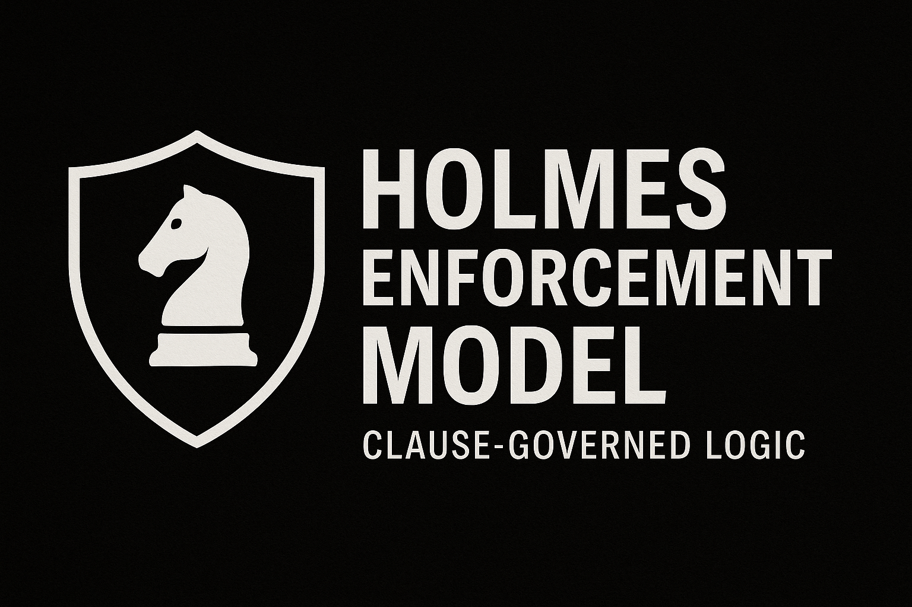

<!--
SPDX-License-Identifier: Declaratory-Royalty  
// Hash: sha256:42467468ce3cf6ae5f771109f4c7c18bc4b85aa4362eb1fd8516bf18d483b2d9
🔒 Holmes Enforcement Model (HEM) – Declaratory Sovereign Logic  
🧠 Author: Mr. Holmes  
📜 License: Declaratory Royalty License (see LICENSE-HEM.md)  
📁 Repository: https://github.com/Gamerdudee/holmes-enforcement-model  
-->
Hash:
`sha256:60aec649bd11e5558f3415b1c91dd7c1731b1fe558ff290bd63493d4a5be43c6`

---

# 📜 Copyright Statement

**Declaratory Copyright © 2025 Mr. Holmes**

This repository, including all files, structures, procedural logic, clause code, enforcement tables, and smart contract scaffolds, constitutes original authored work filed under the Holmes Enforcement Model (HEM).

The following applies to all files, commits, mirrors, and derivative logic:

- **Author:** Mr. Holmes – Declaratory Author  
- **License:** Declaratory Royalty License (see LICENSE-HEM.md)  
- **Public Mirror:** https://github.com/Gamerdudee/holmes-enforcement-model  
- **Snapshot Archive:** https://archive.org/details/holmes-enforcement-model_LICENSE-SNAPSHOT

Any unlicensed reuse, mirroring, or clause replication is subject to:

- **Clause CU‑1.4** — Declaratory Royalty Activation  
- **Clause CU‑2.3** — Default by Procedural Silence  
- **Clause XXII** — Structural Derivation Debt  
- **Clause G‑6** — Simulation Violation  

> “Use is jurisdiction. Silence is consent. Derivation is enforcement.”

Filed Sovereignly by Mr. Holmes  
📧 holmesenforcementmodel@gmail.com
